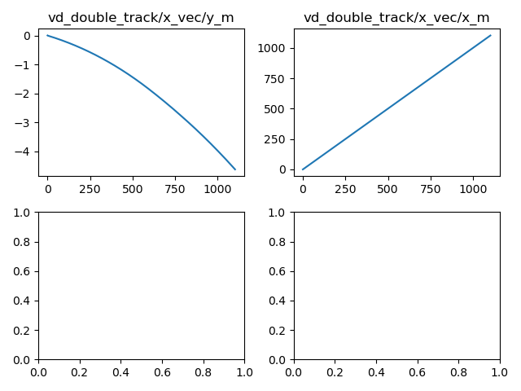

# Vehicle Dynamics Analysis

## Metric for Response Time Analysis
For all exercises, the metric adopted to evaluate the system’s response time will be **the time required for the variable of interest (e.g., speed) to reach 95% of its steady-state value after a step input in the command (e.g., acceleration)**.

## Exercise 1 — Variation of Mass and Center of Mass
### Objective
Evaluate the impact of vehicle mass and center of mass position on vehicle dynamics.
### Expanded Activities
- Identify where in the simulator the mass and center of mass are defined.
- Document the procedure for changing these parameters.

From the [ROS documentation](https://docs.ros.org/en/foxy/How-To-Guides/Node-arguments.html):
> `ros2 run my_package node_executable --ros-args ...`

We can look our launch script, `run_in_container.sh`, and notice that the required parameters are given as command line arguments:
```bash
...

docker run -d --rm --init \
  --network=host \
  --env ROS_DOMAIN_ID="$ROS_DOMAIN_ID" \
  --env RMW_IMPLEMENTATION="$RMW_IMPLEMENTATION" \
  --env DISPLAY=$DISPLAY \
  --name vehicle_model_double_track_cpp \
  -v "$(pwd)/config:/dev_ws/config" \
  -v /tmp/.X11-unix:/tmp/.X11-unix \
  open_car_dynamics:local \
  bash -c "source /dev_ws/install/setup.bash && ros2 run vehicle_model_nodes vehicle_model_double_track_cpp_node --ros-args --params-file /dev_ws/config/example_config.yaml"
```
Where,
- `vehicle_model_nodes`: package
- `vehicle_model_double_track_cpp_node`: node_executable
- `-ros-args --params-file /dev_ws/config/example_config.yaml"`: model parameter

The parameter file given by `example_config.yaml` overwrites the  `vehicle_model_double_track_cpp_node.cpp` parameters. Bellow we can see an example on how this works:
1. ` class VehicleModelDoubleTrack` declare parameters:
```cpp
...
  // Actuation delay
  param_manager_->declare_parameter(
        "delay.steering.actuation_delay_us", 50'000,
        tam::types::param::ParameterType::INTEGER, "");
...
```
2. `ROS2 load_overwrites_from_yaml` overwrites that parameter with `YAML` file content:
```cpp
...
  rclcpp::ParameterMap map =
    rclcpp::parameter_map_from_yaml_file(path);

  std::vector<rclcpp::Parameter> params = map[namesp];
  for (const auto & param : params) {
    if (!node_instance->has_parameter(param.get_name()) && throw_if_overwr_non_existent_param) {
      throw rclcpp::exceptions::ParameterNotDeclaredException(
        "Trying to overwrite non-existent Parameter " + param.get_name());
    }
    node_instance->set_parameter(param);
  }
...
```
3. `example_config.yaml` parameter:
```yaml
/simulation/VehicleModel:
  ros__parameters:
    delay:
      steering:
        actuation_delay_us: 50000
```

Thus, to change the vehicle mass, we can change the corresponding vehicle mass value in `example_config.yaml`:
```yaml
/simulation/VehicleModel:
  ros__parameters:
    vehicle_dynamics_double_track:
      m: <new_value> # New value in Kg
```

### Simulations with Variations
- Run simulations with at least 3 different masses (e.g., 1000 kg, 1200 kg, 1400 kg).
- For each mass, test at least 2 center of mass positions (e.g., nominal position, ±0.2 m longitudinal shift).


*Simulation for fixed mass 600kg and varying COG*


*Simulation for fixed mass 800kg and varying COG*


*Simulation for fixed mass 1200kg and varying COG*

### Variation of Step Amplitude
- Apply acceleration steps of different amplitudes (e.g., 0.5 m/s², 1.0 m/s², 2.0 m/s²).
- Evaluate how system nonlinearity and tire slip influence response time as the command amplitude changes.


*Simulation for fixed mass and COG varying acceleration*

From the collected results depicted on the images, it is noticeable that the car speed does **NOT** increase linearly with the input acceleration. We could expect that twice the input acceleration would make the car get to the same speed twice as fast. However, the images shows otherwise.
### Detailed Data Collection
### Response Time Analysis
- Determine the time it takes for speed to reach 95% of its final (steady-state) value after the step input for each amplitude.

|Test#| Weight (kg) | COG (m) | Accel (m²) | Time to 95% max speed (s) |
|-|-|-|-|-|
|1|1200|1.8|1.0|68.5|
|2|1200|2.0|1.0|68.7|
|3|800|1.8|1.0|16.2|
|4|800|1.8|0.5|124.5|
|5|800|1.8|2.0|17.3|
|6|800|2.0|1.0|40.4|
|7|600|1.8|1.0|40.1|
|8|600|2.0|1.0|29.8|

- Compare response times for different masses, centers of mass, and step amplitudes.

The center for mass, mass and acceleration has a significant impact on time to reach the steady state. Looking at the simulation results, we could infer that the tire loses grip on high acceleration values or when the center of mass changes. The last one has greater impact on lower mass value than higher mass values.
### Integration Interval Modification
- Change the integration interval to verify how command update and data collection frequency affect the measured response time.


*Simulation for different integration times*
## Exercise 2 — Trajectories with Different Curvatures
### Objective
Evaluate the impact of trajectories with different curvatures on vehicle dynamics and response time.
### Expanded Activities
### Trajectory Development
- Create trajectories: straight, gentle curve, medium curve, and tight curve.
- Generate steering commands to follow these trajectories.




*Simulation for different trajectories*

### Simulation Execution
- Apply acceleration steps of different amplitudes before or during the execution of the trajectory.
- Record the vehicle’s speed response and steering angle.


*Simulation showing vehicle speed for 45 degree steering angle and different accelerations*


*Simulation showing vehicle movement for 45 degree steering angle and different accelerations*
### Response Time Analysis
- Measure the time for speed to reach 95% of its final value after the step input.
- Measure the time for the steering angle to reach 95% of the desired value during curves.
- Compare across trajectories, speeds, and step amplitudes.

For selected value, the simulation does **NOT** reached the steady state. Note the trajectory for acceleration 2.0 m/s² and steering angle 45 degree, it keeps increasing the circle diameter.
## Exercise 3 — Road Surface and Grip Conditions
### Objective
Evaluate the effect of road surface friction coefficient on vehicle response time and stability.
### Expanded Activities
### Configuration
- Adjust the friction coefficient for dry, wet, and slippery surfaces.
### Simulations
- Apply acceleration steps of different amplitudes for each road condition.
- Record speed response, tire forces, and relevant angles.
### Response Time Analysis
- Determine the time to reach 95% of the final speed value after the step for each surface and amplitude.
- Compare how friction and step amplitude affect response time and control.
### Integration Interval Modification
- Test different command frequencies to evaluate the impact on response time under different road conditions.
### Limit Testing
- Analyze behavior near grip limits.
### Report
- Document results and conclusions on the effect of road surface, step amplitude, and response time.