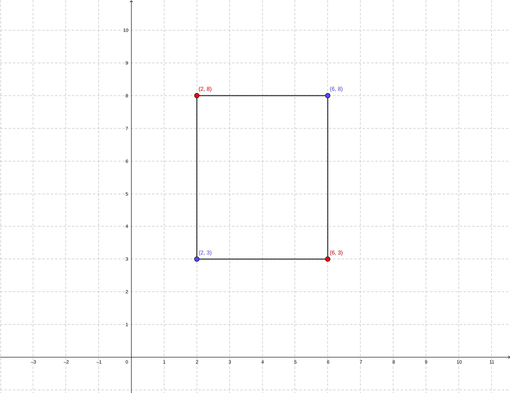

# World and Object Representation

## Exercises

1. **Bounding Box Definition**
- Given a 2D bounding box defined by $\displaystyle (x_{min},y_{min},x_{max},y_{max}) = (2,3,6,8)$, list all four corner coordinates.

    The bounding box corner will be given by $\displaystyle p_1=(2,3),\;p_2=(2,8),\;p_3=(6,8)\; {\textstyle and}\; p_4=(6,3)$.

    

- Compute the area of the bounding box.

    The area of the bounding box is,

    ```math
    box_{area}=(x_{max}-x_{min})\times(y_{max}-y_{min})
    ```

    Then,

    ```math
    box_{area}=(6-2)\times(8-3) = 20
    ```

    The $\displaystyle box_{area}=20$.

2. **Bounding Boxes and Occupied Space**
- (a) Given a 3D bounding box with parameters $\displaystyle (x,y,z,l,w,h,\Psi)=(5,3,0,4,2,2,45^\circ)$, compute the volume occupied by the object.

    The volume $\displaystyle box_{volume}$ occupied by the object is given by:
    ```math
    box_{volume}=l \times w \times h = 4 \times 2 \times 2 = 16
    ```

- (b) If the bounding box in (a) is rotated by $\displaystyle \Psi=45^\circ$, sketch (or describe) how the occupied space differs compared to $\displaystyle \Psi=0^\circ$.

    To plot the a 2D version of the bounding box, we need at least four points. From the object perspective, we can easily find,

    ```math
    A=(-\frac{l}{2},-\frac{l}{2})
    ```

    The heading $\displaystyle \Psi$ is the measured angle of object local reference relative to the global origin coordinate $\textstyle X\!-\!axis$, using the right hand rule. Which means that the rotation will be along the $\textstyle Z\!-\!axis$. The Z rotation matrix is given by:

    ```math
    R_z(\theta)=\begin{bmatrix}
        \cos\theta & -\sin\theta & 0 \\
        \sin\theta & \cos\theta & 0 \\
        0 & 0 & 1
    \end{bmatrix}
    ```

    Assuming the initial object direction is in $\textstyle X\!-\!axis$, we can define a vector unit vector,

    ```math
    P=\left[\begin{array}{c} x \\ y \\ z \end{array}\right]
    ```

    The rotation is,

    ```math
    v'=R_z(\theta) \times v=\begin{bmatrix}
        \cos\theta & -\sin\theta & 0 \\
        \sin\theta & \cos\theta & 0 \\
        0 & 0 & 1
    \end{bmatrix} \times \left[\begin{array}{c} 1 \\ 0 \\ 0 \end{array}\right]
    ```

    Solving the multiplication,

    ```math
    v'=\left[\begin{array}{c} \cos\theta \\ \sin\theta \\ 0 \end{array}\right]
    ```


- (c) Two 2D bounding boxes $\textstyle B_1\; and\; B_2$ are defined as:
    ```math
    B_1:(x_{min},y_{min},x_{max},y_{max})=(0,0,4,3),\; B_2:(2,1,6,5).
    ```
    Compute their intersection-over-union (IoU).