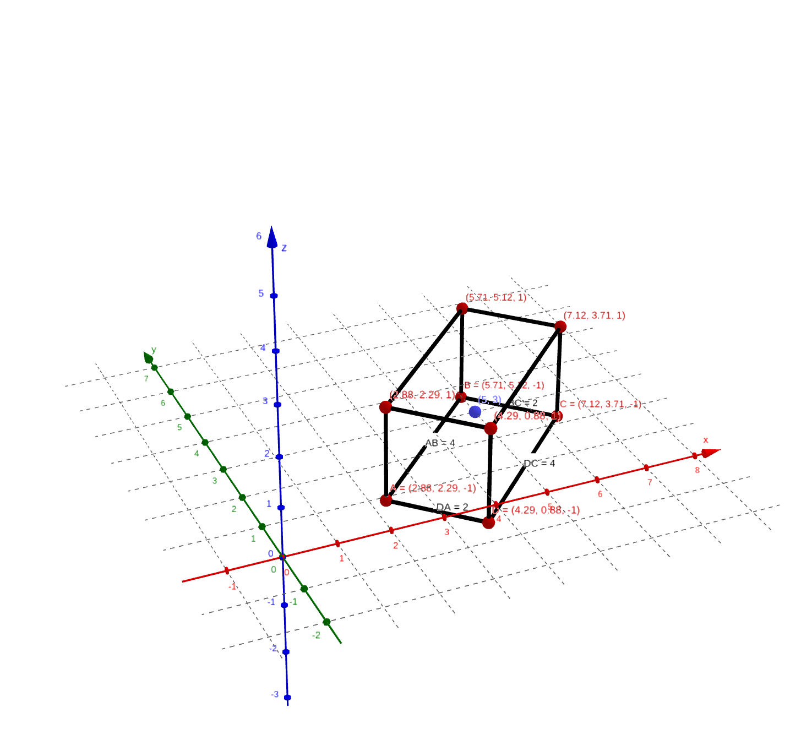
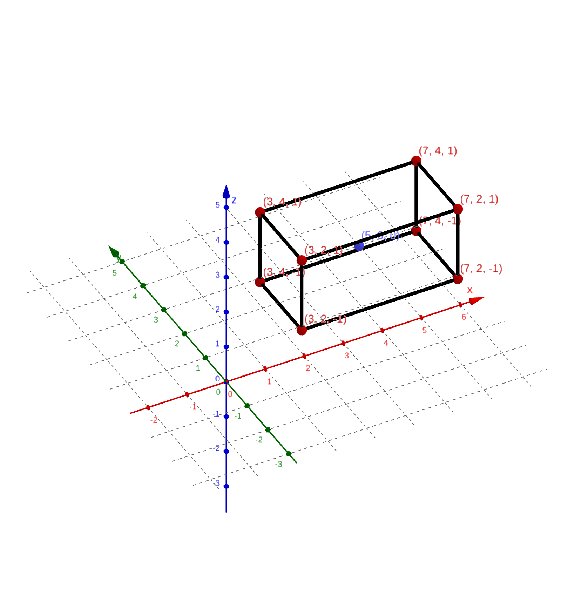
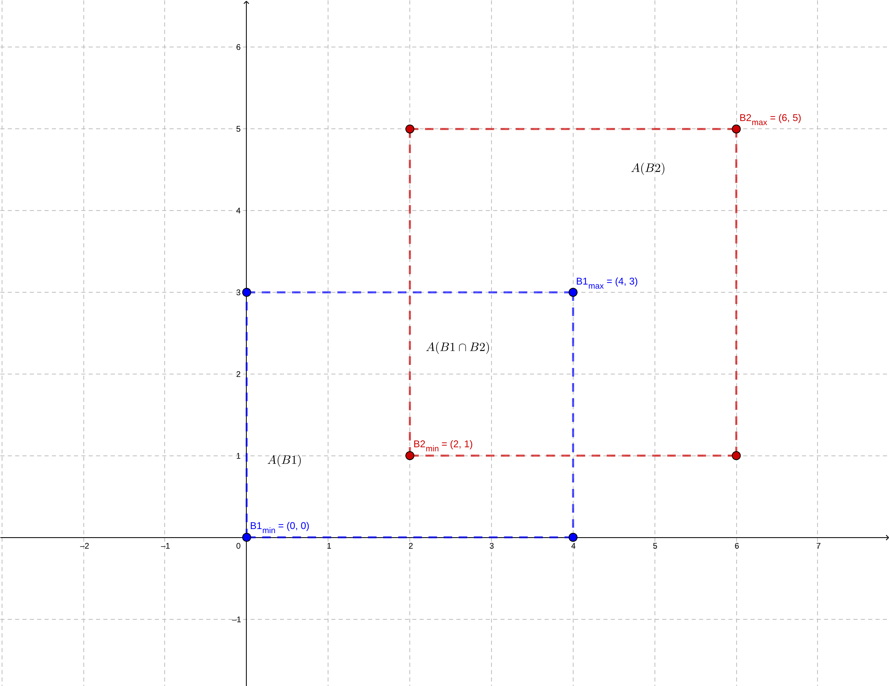
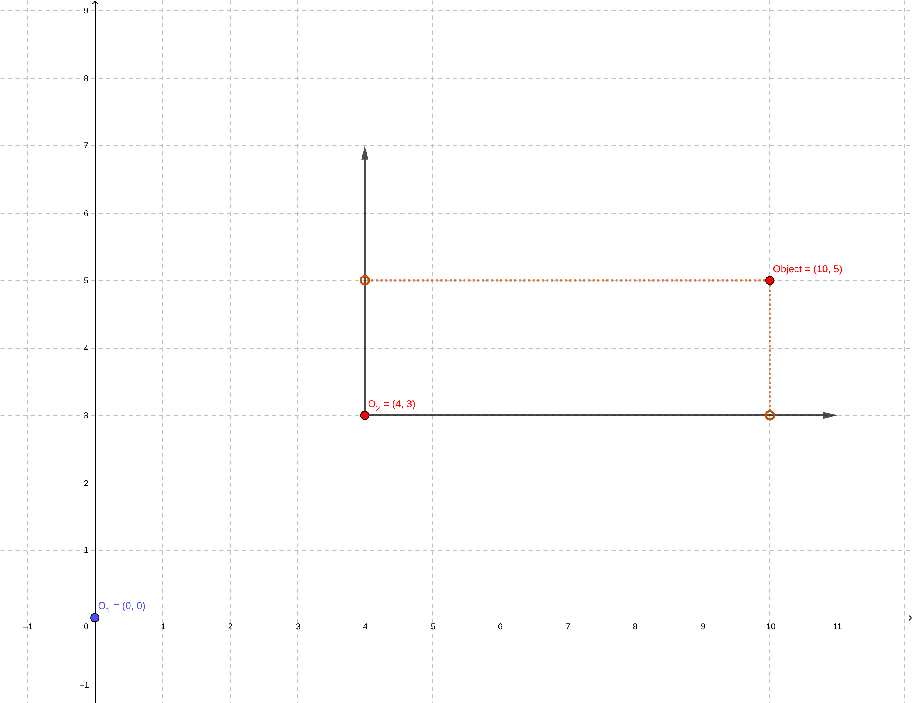

# World and Object Representation

## Exercises

1. **Bounding Box Definition**
- Given a 2D bounding box defined by $\displaystyle (x_{min},y_{min},x_{max},y_{max}) = (2,3,6,8)$, list all four corner coordinates.

    The bounding box corner will be given by $\displaystyle p_1=(2,3),\;p_2=(2,8),\;p_3=(6,8)\; {\textstyle and}\; p_4=(6,3)$.

    

- Compute the area of the bounding box.

    The area of the bounding box is,

    $$box_{area}=(x_{max}-x_{min})\times(y_{max}-y_{min})$$

    Then,

    $$box_{area}=(6-2)\times(8-3) = 20$$

    The $\displaystyle box_{area}=20$.

2. **Bounding Boxes and Occupied Space**
- (a) Given a 3D bounding box with parameters $\displaystyle (x,y,z,l,w,h,\Psi)=(5,3,0,4,2,2,45^\circ)$, compute the volume occupied by the object.

    The volume $\displaystyle box_{volume}$ occupied by the object is given by:

    $$box_{volume}=l \times w \times h = 4 \times 2 \times 2 = 16$$

- (b) If the bounding box in (a) is rotated by $\displaystyle \Psi=45^\circ$, sketch (or describe) how the occupied space differs compared to $\displaystyle \Psi=0^\circ$.

    The heading $\displaystyle \Psi$ is the measured angle of object local reference relative to the global origin coordinate $\textstyle X-axis$, using the right hand rule. Which means that the rotation will be along the $\textstyle Z-axis$. The Z rotation matrix is given by:

    $$R_z(\theta)=\begin{bmatrix}
        \cos\theta & -\sin\theta & 0 \\\\ \sin\theta & \cos\theta & 0 \\\\ 0 & 0 & 1\end{bmatrix}$$

    Assuming the initial object direction is in $\textstyle X-axis$, we can write,

    $$P=\left[\begin{array}{c} x \\\\ y \\\\ z \end{array}\right]$$

    The rotation is,

    $$P_r=R_z(\theta) \times P=\begin{bmatrix}
        \cos\theta & -\sin\theta & 0 \\\\ \sin\theta & \cos\theta & 0 \\\\ 0 & 0 & 1 \end{bmatrix} \times \left[\begin{array}{c} x \\\\ y \\\\ z \end{array}\right]$$
    
    $$P_r=\begin{bmatrix} x\cos\theta-y\sin\theta \\\\
        x\sin\theta+y\cos\theta \\\\
        z \end{bmatrix}$$

    The translation matrix is,

    $$T=\begin{bmatrix} 1 & 0 & 0 & x \\\\ 0 & 1 & 0 & y \\\\ 0 & 0 & 1 & z \\\\ 0 & 0 & 0 & 1 \end{bmatrix}$$
    
    Applying the rotation and translation for each corner, $\displaystyle P'=T\times R_z \times P$,

    |||
    |-|-|
    |*Show bounding box when $\Psi=45^\circ$*|*Show bounding box when $\Psi=0^\circ$*|

- (c) Two 2D bounding boxes $\textstyle B_1\; and\; B_2$ are defined as:

    $$B_1:(x_{min},y_{min},x_{max},y_{max})=(0,0,4,3),\; B_2:(2,1,6,5).$$

    Compute their intersection-over-union (IoU).

    Given the two bounding boxes depicted in the image bellow, we will calculate the $\displaystyle A(B1\cap B2)$ first,

    

    The intersection are, denoted by $\displaystyle A(B1\cap B2)$ can be calculated as,

    $$A(B1\cap B2)=(b1_{x_{max}}-b2_{x_{min}}) \times (b1_{y_{max}}-b2_{y_{min}})$$

    $$A(B1\cap B2)=(4-2) \times (3-1)=4$$

    The area for each bounding box is,

    $$A(B1)=4 \times 3 = 12,\\ A(B2)=(5-1) \times (6-2)=4 \times 4 = 16$$

    The area of the union,

    $$A(B1 \cup B2)=A(B1)+A(B2)-A(B1\cap B2) \\\\
    A(B1 \cup B2)=12+16-4=24$$

    Finally, we can calculate the $IoU$,

    $$IoU=\frac{A(B1\cap B2)}{A(B1 \cup B2)} = \frac{4}{24}= \frac{1}{6} \approx 0.1666$$

3. **Confidence and Uncertainty**
- A detector outputs a bicycle at 0.65 confidence. Discuss whether this uncertainty is more likely to be aleatoric or epistemic in the following scenarios:

  - (a) The bicycle is partially hidden behind a bus.

    This is more likely to be *aleatoric*. The bicycle is only partially observable by the detector.

  - (b) The detector was trained mostly on car and pedestrian classes, with few examples of bicycles.

    This is more likely to be *epistemic*. The detector need a better dataset with more classes for bicycles.

- A detector identifies a pedestrian at 0.85 confidence under foggy conditions. Which type of uncertainty (aleatoric or epistemic) is dominant, and why?

    The dominant uncertainty is *aleatoric*. The foggy condition is a environmental effect. Note that in such adverse condition, this high 0.85 confidence could be a false positive.

- An object is detected at 0.40 confidence. Suggest two possible ways to reduce epistemic uncertainty for this case.

    Increase the dataset for this specific scenario by collecting more data under similar condition. And create more scenarios, to increase detection confidence in new-but-similar scenarios where the detector will have good confidence even in cases it never saw, but was trained in a dataset with similar scenario.

- Suppose the detector assigns high confidence (0.95) to a phantom detection caused by sensor reflection. Discuss why confidence alone may be misleading in safety-critical contexts.

    This is a false positive case where the detector sees something that is not there. Confidence is the indicator on how confident the detector is about its detection. Factors such as bad bounding box selection, lack of training data, faulty sensors, etc, can trick the detector into wrong classifications.

4. **Coordinate Transformation**
- An object is observed in the local frame of vehicle $O_1$ at position $(px, py) = (10,5)$ m.
- The origin of $O_2$ is 4m east and 3m north of $O_1$.
- Compute the position of the object relative to $O_2$ assuming both vehicles use ENU coordinates.

    Given the $Object$ and origins $O_1$ and $O_2$, depicted bellow,

    

    The position $P'$ of the objective relative to $O_2$ is,

    $$P'=(x_{obj}-x_{O_2},y_{obj}-y_{O_2})=(10-4,5-3)$$
    $$P'=(6,2)$$

- An observer $O_3$ detects and object at $(p_x,p_y)=(15,-3)$ m. Observer $O_4$ is located 10 m east and 2 m north of $O_3$. Express the object's coordinates in $O_4$'s frame.

## Reference
[[1]](https://geogebra.org). Images generated using the online tool available in https://geogebra.org.

